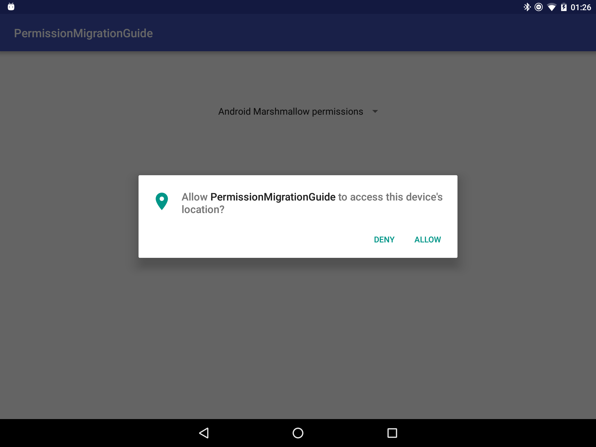
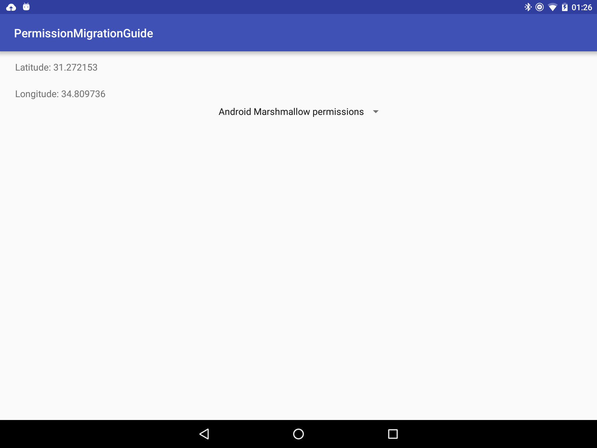
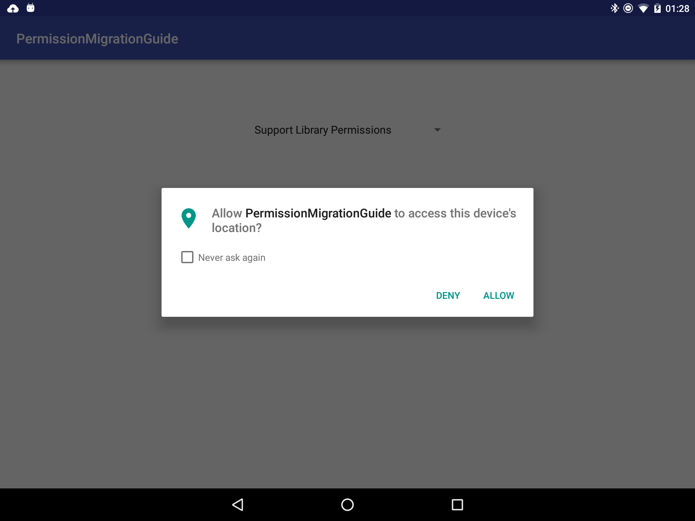

# PermissionMigrationGuide
Demo location permissions in Android Marshmallow

This sample uses
[Google Play services (GoogleApiClient)](ihttps://developer.android.com/reference/com/google/android/gms/common/api/GoogleApiClient.html)
and the
[FusedLocationApi] (https://developer.android.com/reference/com/google/android/gms/location/LocationServices.html).

To run this sample, **location must be enabled**.

Api requirements
--------------

- Android SDK v23
- Android Build Tools v23.0.1
- Android Support Repository

Screenshots
-------------
 

 
